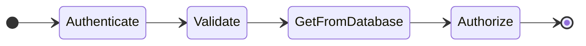

# StateFusion

**Note: StateFusion is in development and probably going to change a lot in its first few weeks!**

StateFusion is a tool to generate test scenarios for a combinatorial, state-result approach to covering tests. This is a form of combinatorial testing that utilizes state-result modeling.

## More Detailed Explanation

**Combinatorial Testing** is a method of approaching automated testing which relies on using some _model_ of a system to generate _combinations_ of conditions to test. [Pairwise testing](https://en.wikipedia.org/wiki/All-pairs_testing) is the most well-known form of this style of testing, which uses a model of the inputs to a system to generate pair combinations of inputs with which the system can be tested.

**State-Based Testing** is not formally defined at a general level, but would encompass various methods of modeling the potential states of a system to discover test paths. [State-transition testing](https://www.geeksforgeeks.org/state-transition-testing/) would be a well-known form of such a category, which generates tests to cover transitions between states in a state machine.

StateFusion is neither a pairwise nor a state-transition testing tool. However, it does support a **combinatorial** and **state-based** method to generating test scenarios for systems that can be modeled as a **series of decisions**.

By way of example, let's suppose we have a REST API which exposes a GET endpoint for some `Item` resource. This system can be modeled as a **series of decisions**: it will authorize the request, validate it, get the resource from the database, check that the authorized caller has access to the resource, and ultimately return the resource. Each step in this series could have many potential results; authorization can succeed or fail, as can validation; the database query could yield the resource, not find it, or error; finally, the caller might or might not have access to the resource.

One or more **conditions** can cause the various decisions to yield their different potential **results**, and as testers we expect our endpoint to respond in different ways when it encounters these different states. If the request is not valid we want to return 400, if we can't find the resource we want to return 404, and so on.

StateFusion takes as input a model of this **series of decisions**, the **conditions** which cause them, and the expected **results** of the system when it encounters the various states. From this input, it combinatorially generates all of the potential states the system might encounter, along with the expected results and conditions which cause them.

## How it Works

The model of the system is made in simple (specialized) Markdown:

```
# Get an Item

* Authenticate: Success | Failure = 403 ? I am not authenticated to access items
* Validate: Success | Failure = 400 ? the request is invalid
* GetFromDatabase: Found ? the item exists | Not found = 404 ? the item does not exist | Error = 500 ? The items table errors on select
* Authorize: Success = 200 | Failure = 401 ? I am not authorized to access the specific item
```

StateFusion then generates the state-result table, as well as a Mermaid diagram showing the decision flow:



|Authenticate|Validate|GetFromDatabase|Authorize|Respond|Conditions|
|---|---|---|---|---|---|
|Success|Success|Found|Success|200|the item exists|
|Success|Success|Found|Failure|401|the item exists and I am not authorized to access the specific item|
|Success|Success|Not found||404|the item does not exist|
|Success|Success|Error||500|The items table errors on select|
|Success|Failure|||400|the request is invalid|
|Failure||||403|I am not authenticated to access items|
