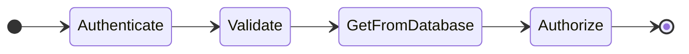

# CFWeaver

**Note: CFWeaver is in development and probably going to change a lot in its first few weeks!**

CFWeaver is a tool to generate test scenarios to exhaustively cover possible control flow paths through a system. This is a form of combinatorial test generation that utilizes control flow modeling to understand the relationship between business requirements and control flow states. It is suitable for systems of any level of complexity in control flow, but not suitable for systems that do not map a relationship between control flow states and business requirements. The best candidates are systems which can enumerate business requirements discretely per decision point in the control flow.

I've written abuot the conditions which caused me to hack this together [on an article on my blog](https://ian.wold.guru/Posts/book_club_1-2025.html).

# Detailed Explanation

## Concepts

CFWeaver combines the following three concepts. It uses control flow models to combinatorially generate test scenarios which exhaustively cover all possible paths through a system. By linking the results of each step in the control flow to the _conditions_ which cause the result and _dependent variables_ which arise from each result, each test scenario can meaningfully describe the business requiremens it tests.

Note that CFWeaver does not generate the tests themselves, rather it generates the scenarios for which tests can later be implemented.

### Model-Based Testing

Model-Based Testing is an approach to testing which generates tests based on some _model_ of the system. There are [various types of models](https://www.geeksforgeeks.org/model-based-testing-in-software-testing/) of systems from which tests can be generated. Different kinds of systems lend themselves to being more naturally described by different kinds of models, while many systems may not be suitable for modeling.

A system can be said to be "naturally modeled" if A: it is to describe the system using a certain model; B: such a model provides value to stakeholders in understanding the system; and C: this utility is strong enough that we desire to maintain the model throughout the system's lifetime. Naturally modeled systems are the best candidates for model-based testing.

### Combinatorial Generation

Combinatorial generation, as a method of generating model-based tests, uses combinatorial techniques to derive all possible tests from a model; that is, counting and enumerating many possibilities that can be described from a more general model. [Pairwise testing](https://en.wikipedia.org/wiki/All-pairs_testing) is the most well-known form of this style of testing, which uses a model of the inputs to a system to generate pair combinations of inputs with which the system can be tested.

### Control Flow Modeling

The control flow is a well-understood programming concept which nonetheless is used in many different ways to understand different aspects of systems. In general, _control flow_ refers to the order and flow of operations through a system, including decision points where the "flow" branches.

In this case where we are specifically concerned with the control flow providing a model of a system for test generation, the _control flow state model_ describes the chain of _steps_ a system executes. Each _step_ may encapsulate any of: an operation; the potential results of that operation; any change in the state of variables dependent on those results; or any branching in the chain.

## Example

By way of example, let's suppose we have a REST API which exposes a GET endpoint for some `Item` resource. The control flow state model will have several steps: it will authorize the request, validate it, get the resource from the database, check that the authorized caller has access to the resource, and ultimately return the resource. Each step in this series could have many potential results; authorization can succeed or fail, as can validation; the database query could yield the resource, not find it, or error; finally, the caller might or might not have access to the resource.

One or more _conditions_ can cause the various decisions to yield their different potential _results_, and as testers we expect our endpoint to respond in different ways when it encounters these different states. If the request is not valid we want to return 400, if we can't find the resource we want to return 404, and so on.

CFWeaver's input model explicitly defines each of the steps in the control flow chain and each of the possible results at each step. For each result, the model includes the condition(s) which cause that result; and either the value returned if that result terminates the operation, or the next step in the chain.

# How CFWeaver Works

The model of the system is made in simple (specialized) Markdown:

```
# Get an Item

* Authenticate: Success | Failure = 403 ? I am not authenticated to access items
* Validate: Success | Failure = 400 ? the request is invalid
* GetFromDatabase: Found ? the item exists | Not found = 404 ? the item does not exist | Error = 500 ? The items table errors on select
* Authorize: Success = 200 | Failure = 401 ? I am not authorized to access the specific item
```

CFWeaver then generates a table showing the exhaustive combinatorial set of paths through the control flow, as well as a Mermaid diagram outlining the steps:



|Authenticate|Validate|GetFromDatabase|Authorize|Respond|Conditions|
|---|---|---|---|---|---|
|Success|Success|Found|Success|200|the item exists|
|Success|Success|Found|Failure|401|the item exists and I am not authorized to access the specific item|
|Success|Success|Not found||404|the item does not exist|
|Success|Success|Error||500|The items table errors on select|
|Success|Failure|||400|the request is invalid|
|Failure||||403|I am not authenticated to access items|
